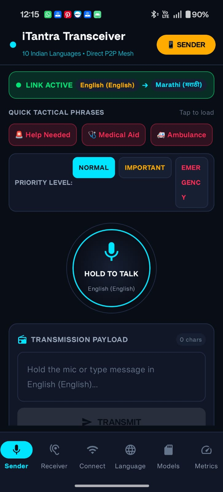
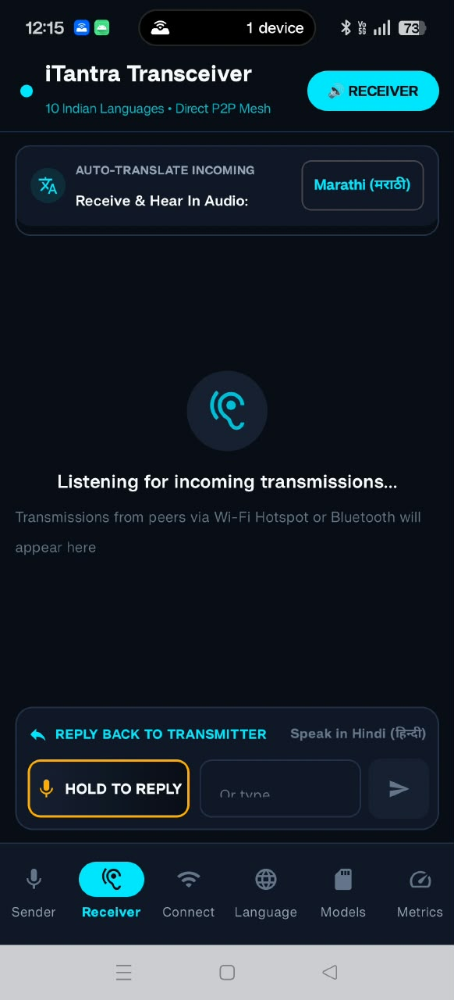
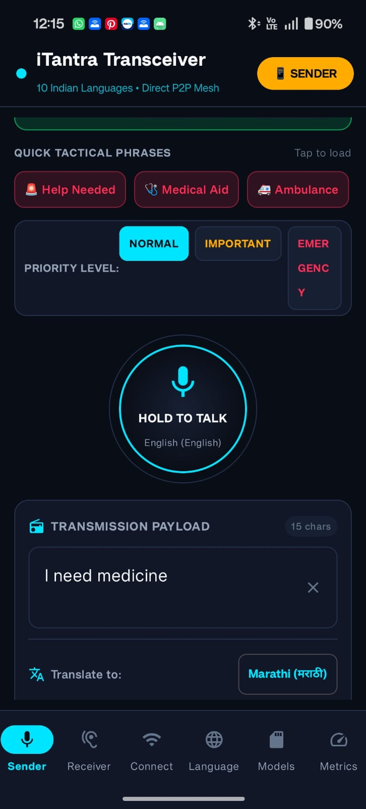
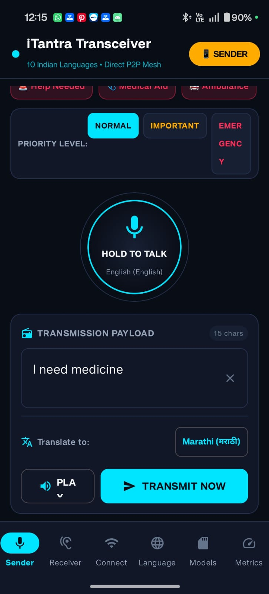
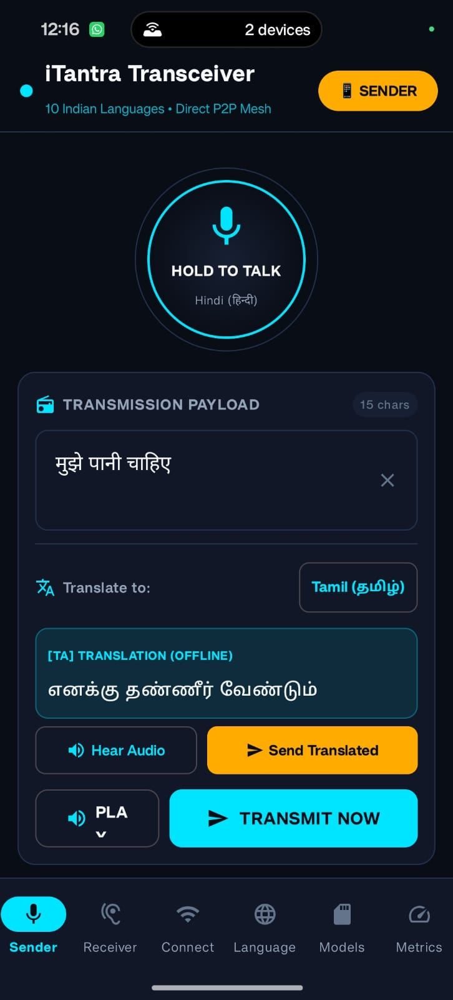
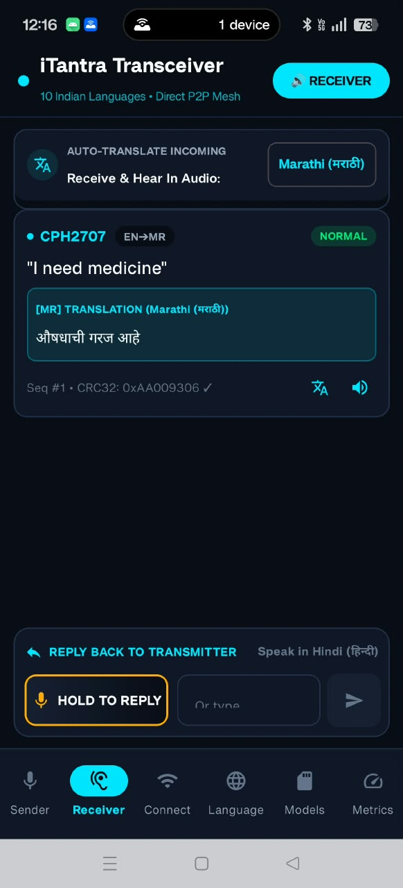
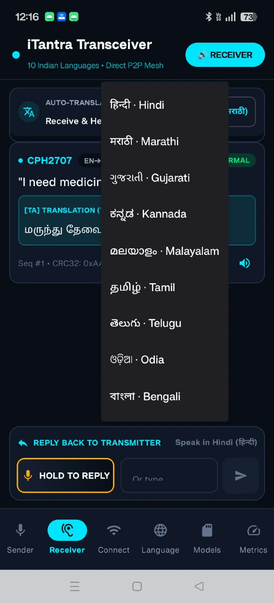
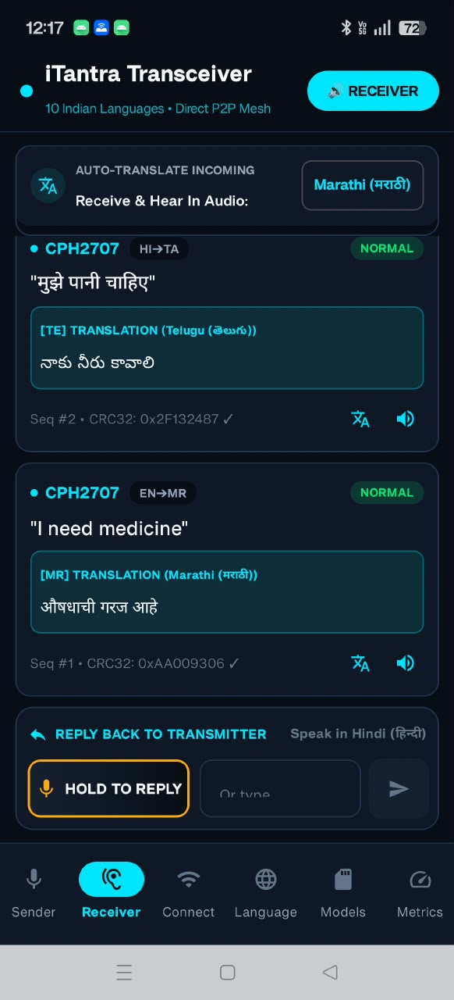
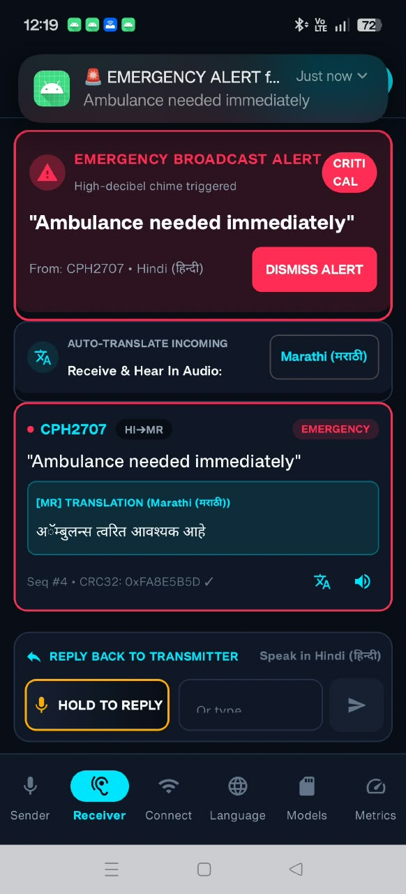
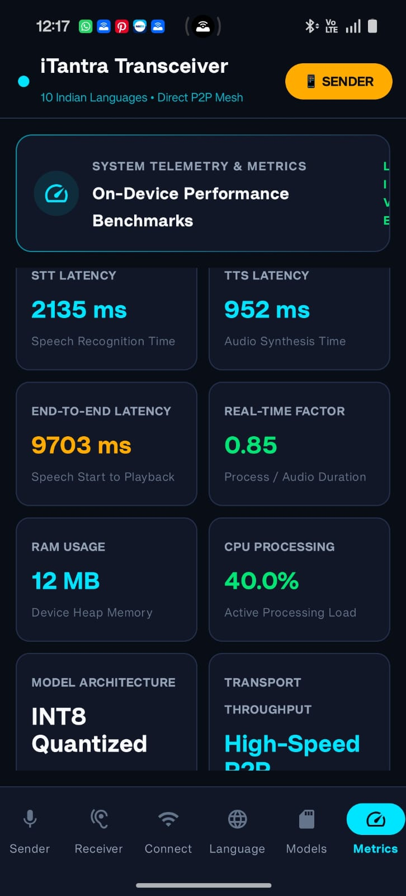

# iTantra 📡

### Indian Multilingual Offline Neural Transceiver for Low-Bitrate Communication

iTantra is an **Android-based offline multilingual communication system** developed for **SIH 2026 Problem Statement 26173 by ISRO**.

It enables two Android devices to communicate through **offline speech-to-text, compact text transmission, and offline text-to-speech**, reducing the amount of data required compared with transmitting raw audio.

---

## 🚀 How It Works

```text
🎙️ Sender Speech
       ↓
  Offline STT
       ↓
      Text
       ↓
 Local Wireless Link
       ↓
      Text
       ↓
  Offline TTS
       ↓
🔊 Receiver Speech
```

The system transmits **text instead of raw voice/audio**, making communication more suitable for constrained or low-bandwidth links.

---

## ✨ Key Features

* 🎙️ Offline Speech-to-Text (STT)
* 🔊 Offline Text-to-Speech (TTS)
* 📡 Low-bandwidth text-based communication
* 📱 Android-to-Android communication
* 📴 No Internet dependency for the core communication pipeline
* 🎙️ Push-to-Talk communication
* 🌐 Support architecture for Indian languages
* 🚨 Emergency / priority message handling
* ⚡ Low-latency communication
* 💾 On-device AI processing
* 📊 Communication and performance monitoring

---

## 🌐 Supported Languages

The application is designed for:

* Hindi
* Gujarati
* Marathi
* Kannada
* Malayalam
* Tamil
* Telugu
* Odia
* Bengali
* English

---

## 🏗️ System Architecture

```text
                    iTANTRA
                       │
          ┌────────────┴────────────┐
          │                         │
      SENDER DEVICE            RECEIVER DEVICE
          │                         │
     🎙️ Microphone              📡 Receive
          ↓                         ↓
     Offline STT               Text Decode
          ↓                         ↓
        Text                    Offline TTS
          ↓                         ↓
   Text Encoding              🔊 Speaker
          │
          └──── Local Wireless ────┘
                Wi-Fi / Bluetooth
```

---

## 🛠️ Technology Stack

### Android

* Kotlin
* Android SDK
* Jetpack Compose
* Gradle

### AI / ML

* On-device Speech-to-Text
* On-device Text-to-Speech
* Open-source ML models
* Model optimization and quantization

### Communication

* Local Wi-Fi
* Bluetooth
* Text-based packet transmission

### Development

* Android Studio
* Git
* GitHub

---

## 📡 Communication Flow

iTantra does not transmit raw speech audio during normal communication.

```text
Speech
  ↓
Offline STT
  ↓
Text
  ↓
Compact Packet
  ↓
Local Wireless Connection
  ↓
Text
  ↓
Offline TTS
  ↓
Speech
```

This approach reduces the amount of data that needs to be transmitted over the communication link.

---

## 🎙️ Push-to-Talk

The sender uses a Push-to-Talk interface:

```text
HOLD
 ↓
Start Recording
 ↓
Offline STT
 ↓
Sentence Detection
 ↓
Transmit Text
 ↓
Release
```

The receiver converts the received text into speech using on-device TTS.

---

## 🚨 Emergency Communication

iTantra supports priority-based communication:

```text
NORMAL
   ↓
IMPORTANT
   ↓
EMERGENCY
```

Emergency messages can be prioritized for faster transmission and immediate audio playback.

---

## 📱 Two-Device Demonstration

### Device A — Sender

```text
Select SENDER
      ↓
Select Language
      ↓
Connect to Receiver
      ↓
Hold to Talk
      ↓
Speak
```

### Device B — Receiver

```text
Select RECEIVER
      ↓
Connect to Sender
      ↓
Receive Text
      ↓
Offline TTS
      ↓
Hear Speech
```

---

## 📸 Outputs / Screenshots

### Sender & Receiver

<p align="center">
  
  
</p>

### Sender Translation

<p align="center">
  
  
  
</p>

### Translation

<p align="center">
  
  
  
</p>

### Emergency & Performance

<p align="center">
  
  
</p>


---

## 📥 Installation

### Requirements

* Android Studio
* Android SDK
* Android device or emulator
* Android 8.0+ recommended
* Sufficient storage for local AI models

### Clone Repository

```bash
git clone https://github.com/K-2004p/iTantra.git
cd iTantra
```

### Build

Open the project in Android Studio and allow Gradle to synchronize.

For Windows:

```powershell
.\gradlew.bat assembleDebug
```

The generated APK will be available under:

```text
app/build/outputs/apk/
```

---

## 📊 Presentation

**Project PPT:**
`[ADD PPT LINK HERE]`

---

## 🎯 SIH 2026 Alignment

**Problem Statement:** 26173
**Organization:** Indian Space Research Organisation (ISRO)

iTantra focuses on:

* Offline multilingual speech processing
* Low-bandwidth communication
* Real-time communication
* Lightweight edge inference
* Android deployment
* Text-based transmission instead of raw audio

---

## 👥 Project

**iTantra — Offline Multilingual Neural Transceiver**

Built for **Smart India Hackathon 2026**.
